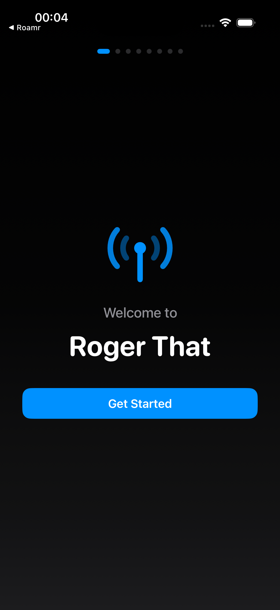
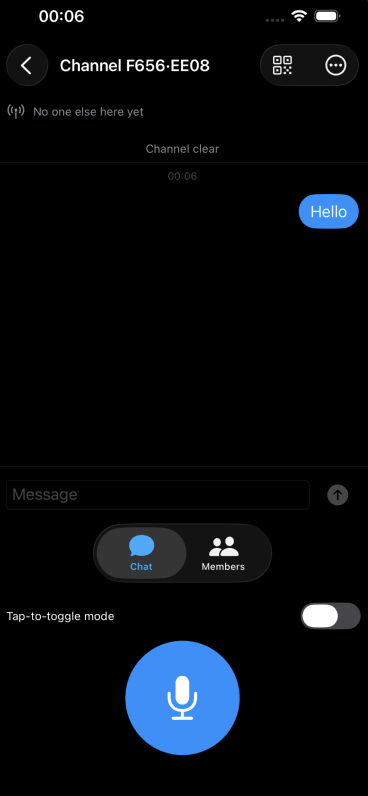
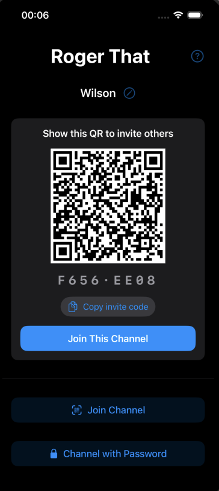

<div align="center">

# Roger That 📻

**An offline-first group walkie-talkie for places with no cell signal** — dense cities, hikes,
ski slopes, festivals.

A small group joins a shared channel while together, then disperses. Within a channel they can
**talk live** (half-duplex push-to-talk) to anyone in direct radio range, and **text** each
other — with messages relayed **hop-by-hop through other members' phones** to reach people beyond
direct range. No servers, no accounts, no internet.

<p>
  
  
  
</p>


</div>

---

## Why it's interesting

Roger That is a from-scratch take on off-grid mesh networking on stock iPhones — no third-party
runtime dependencies, just Apple's radios and a hand-built protocol. The hard problems are all
here: a custom binary wire format, layered end-to-end encryption, TTL-bounded flood routing,
voice jitter buffering, and the notoriously fiddly Multipeer connection lifecycle — each
extracted into **pure, deterministic, unit-tested logic** rather than buried in device callbacks.

---

## Highlights

### 🧩 An enforced architectural seam
The codebase is split into two targets with a **strictly enforced boundary**:

- **`RogerThatCore`** — a platform-agnostic Swift Package that imports **only Foundation +
  CryptoKit**. Every hard problem (protocol, routing, crypto, jitter buffering, retry policy)
  lives here, so it compiles and unit-tests on any macOS/Linux box with `swift build`.
- **`App/RogerThat`** — the iOS app; everything that needs a **radio, mic, or screen**.

> The rule: if it needs a radio, mic, or screen, it belongs in the App target — never in Core.

Every transport (BLE, Multipeer, in-memory, or a hypothetical future LoRa/satellite link)
conforms to one `Link` protocol, so **routing and crypto never change when the radio is
swapped.**

### 🔐 Custom binary protocol + layered encryption
A fixed **22-byte big-endian header** (version, type, flags, TTL, channel-hash, sender,
message-id, length) + an encrypted body. Bodies are sealed with **ChaChaPoly AEAD** — per text
message *and* per voice frame. Password channels derive their key with **PBKDF2-HMAC-SHA256**
(100k iterations, hand-rolled on CryptoKit and verified against the RFC test vectors); a short
non-secret HKDF **fingerprint** lets both sides confirm they typed the same password.

### 🌐 Real distributed-systems engineering
- **TTL-bounded flood routing** (TTL=8) with split-horizon and a size/time-bounded `SeenCache`
  for dedup.
- **Voice jitter buffer** that reorders, de-dups, and conceals lost frames — pure logic, fully
  unit-tested.
- A **Multipeer "single-inviter + retry"** design that resolves the classic competing-session
  vs. deadlock tradeoff (determinism for stability, retry for liveness).
- **Multi-channel over one shared radio** via `LinkHub`, which fans a single BLE stack out to N
  per-channel sessions.

### ✅ Test-first core
**90+ unit tests across 12 suites** (Swift's built-in `import Testing`), all against the pure
Core — packet codec, crypto, flood router, jitter buffer, join codes, retry/backoff policy,
presence back-off, and more.

---

## Tech stack

| Concern | Choice |
|---|---|
| Language / UI | **Swift 6**, SwiftUI, iOS 17+ |
| Radios | **CoreBluetooth** (text + presence mesh), **MultipeerConnectivity** (voice) |
| Audio | AVFoundation / AVAudioEngine (16 kHz mono PCM; Opus is a documented TODO) |
| Crypto | CryptoKit — ChaChaPoly AEAD, PBKDF2, HKDF |
| Storage | Keychain (channel keys) + UserDefaults + debounced on-disk chat history |
| Build | Swift Package Manager + **XcodeGen** · **zero third-party runtime dependencies** |

---

## Architecture

```
RogerThat/
  Package.swift               Swift Package: RogerThatCore library + tests
  project.yml                 XcodeGen spec for the iOS app target
  Sources/RogerThatCore/      Platform-agnostic core (Foundation + CryptoKit only)
    Protocol/                 PacketCodec (22-byte header), Packet, MessageType, VoiceBody
    Mesh/                     FloodRouter (TTL flood, split-horizon), SeenCache (dedup)
    Crypto/                   ChannelCrypto (ChaChaPoly), PasswordKey (PBKDF2)
    Transport/                Link protocol, InMemoryLink, LinkHub, MultipeerRetryPolicy
    Channel/                  Channel, ChannelMetadata, JoinCode (URL-safe base64)
    Audio/                    AudioCodec, RawPCMCodec, VoiceJitterBuffer (reorder/conceal)
    Session/                  SessionManager, Roster, PTTFloor, PresenceBeaconPolicy
  App/RogerThat/              iOS app: BLE + Multipeer transports, AudioEngineIO, PTT, SwiftUI
  Tests/RogerThatCoreTests/   90+ tests across 12 suites
```

## Wire protocol

Big-endian, fixed 22-byte cleartext header + (optionally encrypted) body.

| Field | Type | Bytes |
|---|---|---|
| version | u8 | 1 |
| type | u8 | 1 |
| flags | u8 | 1 (bit0 = body encrypted) |
| ttl | u8 | 1 |
| channelIDHash | u32 | 4 |
| senderID | u32 | 4 |
| messageID | u64 | 8 |
| payloadLen | u16 | 2 |
| body | [payloadLen] | variable |

Encrypted body layout: `nonce(12) ‖ ciphertext ‖ tag(16)` (ChaChaPoly).

## Status

The **pure Core is implemented and verified by 90+ unit tests** and `swift build`. The
device-only paths (BLE mesh, Multipeer voice, live audio) are wired and documented, with
on-hardware integration testing in progress — see [`STATUS.md`](STATUS.md) for the current
verification matrix. Framed honestly: *core logic proven by tests; end-to-end on-device is the
work in flight.*

## Build

```bash
# Core — no Xcode required
swift build

# App — Xcode 15+
brew install xcodegen        # one-time
xcodegen generate            # creates RogerThat.xcodeproj from project.yml
open RogerThat.xcodeproj
```

See [`RUN_ON_DEVICE.md`](RUN_ON_DEVICE.md) for the device-install checklist.

## License

Released under the **MIT License** — see [`LICENSE`](LICENSE).
